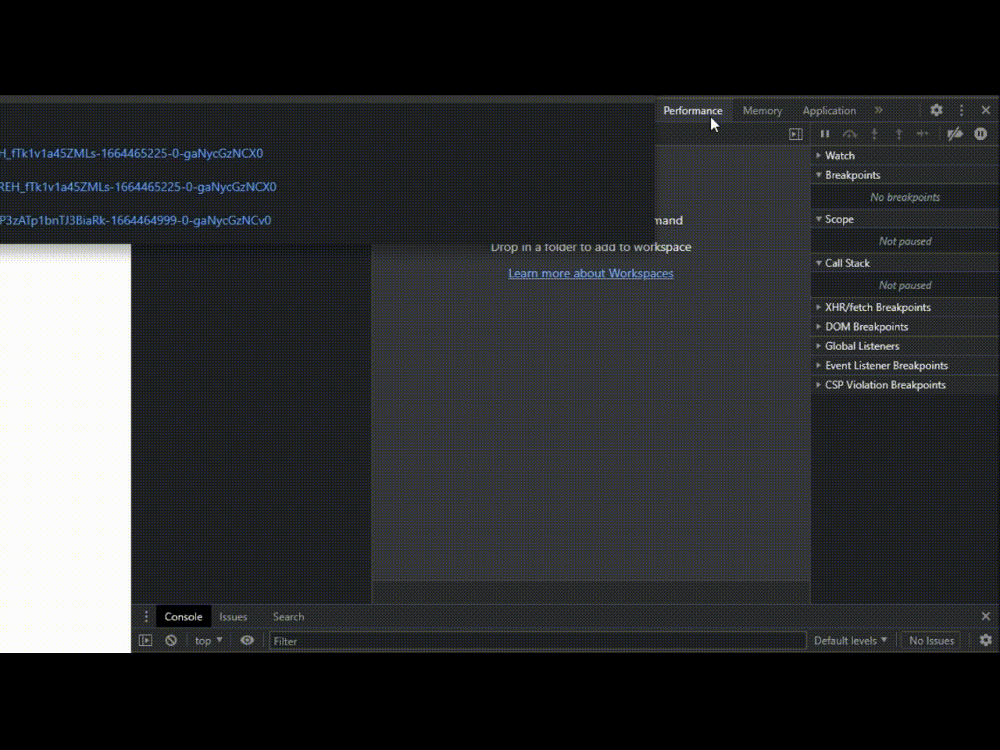

# cloudflare-main-challenge-deobfuscator
A series of ast-manipulations to create more readable cloudflare script code.

## Features
**Conversion of all strings:**  
from:
```js
return g[b(_[72])][b(_[10])][b(_[74])][b(_[119])](h)===b(_[137])
```  
to:
```js
return g.Object.prototype.toString.call(h) === "[object Array]";
```

**Simplifying the function call:**  
from:
```js
var m['foo'] = function (a,b) {
  return a + b;
},
n = m;

return n['foo'](a,b);
```
to:
```js
var m['foo'] = function (a,b) {
  return a + b;
},
n = m;

return a + b;
```
**Simplifying the object props access:**  
from:
```js
var e['foo'] = '300',
g = e;

F.width = g['foo']
```

to:
```js
var e['foo'] = '300',
g = e;

F.width = '300'
```

**Simplifying logical branches:**  
from:
```js
if ('foo' === 'foo') {
  return bar;
}
```
to:
```js
return bar;
```

**Main control flow flattening conversion**  


## usage
```
git clone https://github.com/rastvl/cloudflare-main-challenge-deobfuscator.git
cd cloudflare-main-challenge-deobfuscator
npm install
```
Paste the main challenge script into `input/cf-main-challenge.js` and then:
```
npm run start
```

## ...
In fact, this is all you need to understand the cloudflare code and prepare your environment to run it automatically. The code is a bit messy, there will be no refactoring)

## How to get main challenge script
The easiest way to get the "main challenge" using devtools is to constantly pause the script execution on the cloudflare page until you come across the desired script:
